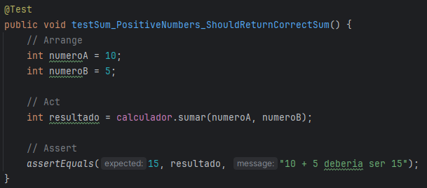

# Actividad: AAA

## Paso 1

La clase Calculator tiene metodos simples para sumar, multiplicar y dividir (tomando en cuenta su excepcion de division por cero)

## Paso 2: Especificación de la tarea

Escribimos los tests para cada uno de los métodos definidos previamente, para esto utilizaremos el patrón AAA (Arrange - Act - Assert) el cual nos permite tener un orden en la escritura de los tests.

Primero usamos la anotacion `@BeforeEach` para que cada que ejecutemos una prueba se establezca el objeto de la clase Calculator 

- Tests para el método `sumar`

- Tests para el método `restar`

- Tests para el método `multiplicacion`

En la multiplicacion tomamos en cuenta los casos negativos para evitar errores de signo

- Tests para el método `division`

En la división se toma en cuenta tanto los casos negativos como la division entre cero. Para manejar este caso se usó una excepcion en la clase `Calculator` por ende usamos `assertThrows` en vez de `assertEquals`

## Paso 3: Ejecución de los tests
Por último ejecutamos todas las pruebas ya sea con el comando `gradle test` o usando la misma interfaz que nos ofrece intellij

Se observa que los 7 tests que codeamos pasaron correctamente las pruebas.