# Actividad Ejemplo de TDD

Para poder comparar dos equipos, cada uno de ellos debe recordar su número de victorias. Por
simplicidad, diseñemos una clase FootballTeam que tome el número de juegos como parámetro del
constructor.

Lo primero es lo primero: asegurémonos de que este constructor funcione.
Comenzamos creando una nueva clase - FootballTeamTest - en algún lugar del directorio
src/test/java.

Ahora procedemos a crear la clase FootballTeam con su constructor y su metodo getGamesWon()

Una vez hecho esto empezamos con el RGR

---

## RED

Al correr la prueba se observa que esta falla como se esperaba

## GREEN

Una vez fallada la prueba empezamos a codear para hacerla pasar

En este caso cambiamos el valor del return de 0 a 3 dado que esa era la causa de que no pase el test. Ahora se observa que las pruebas pasan satisfactoriamente

## REFACTOR

Una vez pasada la prueba, refactorizamos el codigo por mas insignificante que sea el cambio. En este caso podemos cambiar el test dado que utiliza una constante (numero magico)

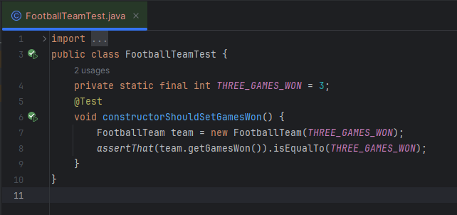

---

Si bien completamos el proceso RGR, el codigo es aun mejorable dado que el valor que esta retornando es estatico (en este caso el 3) podemos usar this. para poder usar diferentes valores (no solo el 3).

***
## RED

Primero cambiamos el test a un test parametizado

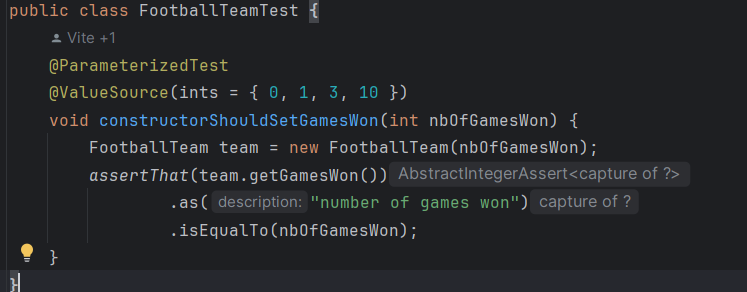

Al correr la prueba se observa que esta falla como se esperaba

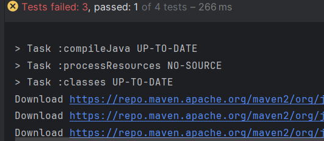

## GREEN

Una vez fallada la prueba empezamos a codear para hacerla pasar

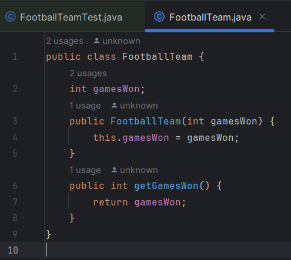

En este caso cambiamos el constructor asi como tambien creamos una variable de la clase FootballTeam y se observa que la prueba pasa correctamente

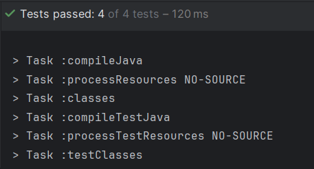

## REFACTOR

No es necesario

***
***

## RED

Esta vez nos ocuparemos de valores inválidos. Basándonos en nuestra experiencia anterior, podemos comenzar con una prueba parametrizada

Esta prueba falla por que el constructor de nuestra clase principal actualmente acepta cualquier valor es decir no tiene un tipo de restriccion

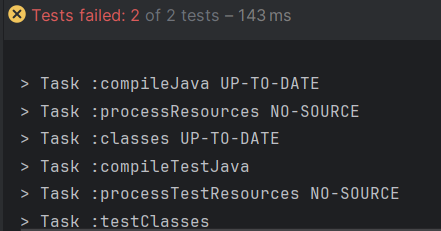

## GREEN

Esto se soluciona añadiendo una condicion al ingreso de los datos

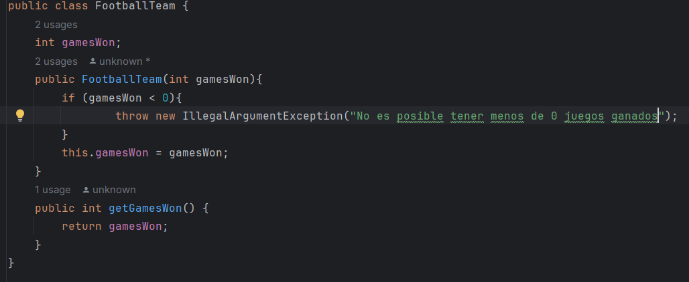

Y nos da como resultado todas las pruebas pasadas

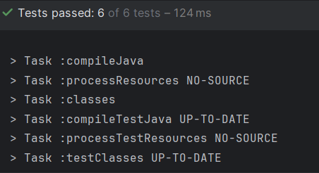

## REFACTOR

No es necesario

***

El constructor funciona bien. Ahora podemos pasar al problema principal: es decir, comparar 
equipos de fútbol. En primer lugar, hemos decidido que vamos a usar la interfaz 
java.lang.Comparable. Esta es una decisión importante que influirá no solo en la implementación de esta clase, sino también en su API y comportamiento esperado. Si FootballTeam es comparable, entonces el cliente puede esperar que una vez que haya puesto unos cuantos equipos en una colección, podrá usar el método Collections.sort() para ordenarlos. Si es así, entonces debería haber una prueba para este comportamiento.

***
## RED
Para probar esto añadimos un test que verifique que la un objeto de la clase FootballTeam sea una instancia de una clase comparable

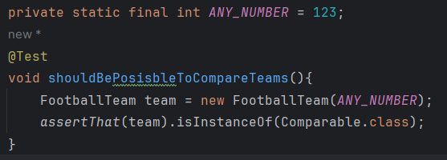

Corremos la prueba y falla 

## GREEN
Implementamos la clase FootballTeam como una instancia de la clase Comparable asi como tambien definimos su metodo compareTo

Una vez hecho esto las pruebas pasan correctamnete

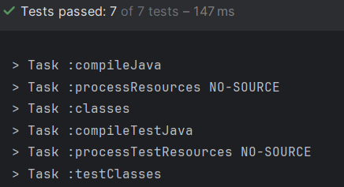

## REFACTOR

No es necesario

***

Ahora escribamos la primera prueba de comparación. La idea es simple: tomar dos equipos con 
diferentes números de victorias y compararlos.

***
## RED

Comparamos 2 equipos mediante sus victorias

Las pruebas fallan como se esperaba

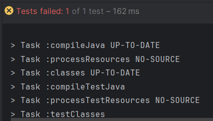

## GREEN

El método compareTo() mostrado a continuación me parece una implementación muy decente que 
hará que la prueba pase

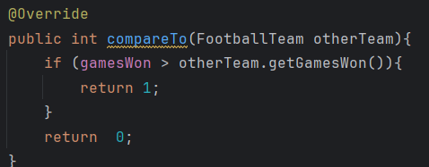

Y las pruebas pasan satisfactoriamente

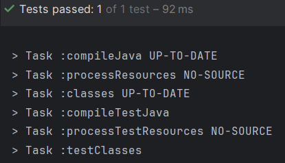

## REFACTOR

En este caso se podria cambiar los nombres para refactorizar el codigo y hacerlo mas legible

***

Vamos a seguir implementando mas pruebas con sus respectivos codigos

***
## RED

Prueba para comparar 2 equipos, uno con menores juegos ganados la cual va a fallar por que aun no esta implementado

## GREEN

Añadimos un if extra para capturar los casos extra que implementamos en los tests y ahora si pasan las pruebas correctamente

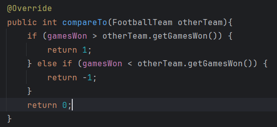

## REFACTOR

Por el momento no es necesario

***

Ahora vamos a pasar a una prueba de igualdad

Esta prueba pasa sin necesidad de codear debido a que previamente retornamos 0 en cualquier caso que no sea mayor o menor por ende cambiamos el 0 por otro numero cualquiera para que pase la prueba a rojo 

