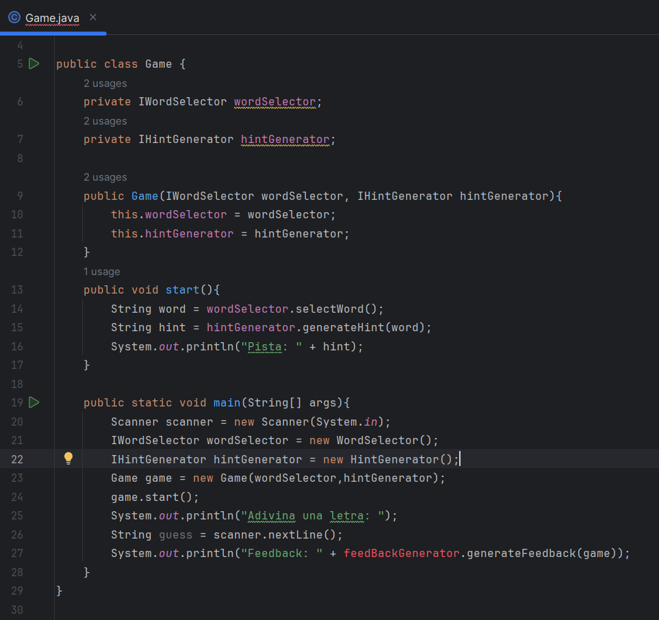
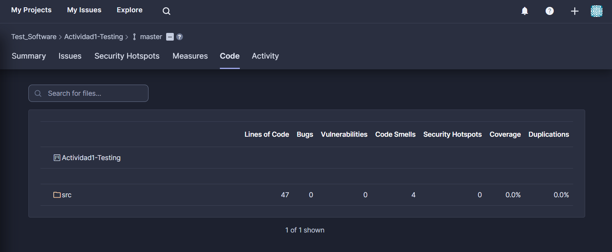

# Sprint 1: Estructura Básica y movimiento del jugador

## Clase WordSelector

Esta clase se encarga de seleccionar una palabra de nuestro repositorio para tomarla como referencia en nuestro juego. Para su implementación usare inyeccion de dependencias, es decir creare una interfaz con los metodos respectivos. Luego nuestra clase WordSelector va a implementar esta interfaz y sobreescribira los metodos para que funcionen correctamente

## Test WordSelector

## Clase HintGenerator

Clase encargada de generar la pista de nuestro juego, esta nos dira por ejemplo cuantas letras tiene la palabra seleccionada. Al igual que con la clase WordSelector, también usaremos inyeccion de dependencias mediante una interfaz.

## Test HintGenerator

## Clase Game

Clase principal del juego que se encarga de inicializar una partida, esta recibiria como parametros al selector de palabras (WordSelector) asi como al generador de pistas (HintGenerator) y por ultimo tendria un metodo para inicializar el juego.

## Test Game

Para desarrollar con TDD primero escribimos pruebas y luego funcionalidades. Testeamos el metodo para inicializar el juego y se observa que la prueba falla por que si bien el metodo start esta definido, su funcionalidad aun no es la correcta. Para esto agregamos logica al metodo start que verifica si la palabra o la pista no sea nula y luego inicializa el juego

Agregamos la lógica necesaria para hacer pasar la prueba y vemos que ahora si pasa todo a verde

## SonarCloud

Para analizar nuestro codigo, ya sean las metricas, codesmells, codecoverage usaremos sonarlint y sonarcloud. Ejecutamos ./gradlew sonar y se observa el analisis en nuestro cloud

Por el momento no se observan problemas asi que no es necesario refactorizar

# Sprint 2: Lógica de juego y retroalimentación

## Clase Game (Ampliación & Refactorización)

En este punto ya queremos ampliar la logica para recibir adivinanzas del jugador, para esto el juego debería iniciar dando la pista. Si queremos añadir esta opcion debemos crear otro metodo aparte de start y volver a instanciar el wordselecter, esto nos llevaria a un mal camino ya que estariamos repitiendo codigo innecesariamente.

## Clase FeedBackGenerator 

En la imagen previa se observa que creamos un objeto del tipo FeedBackGenerator para tener un seguimiento de los intentos del usuario para adivinar la palabra. Para implementarla, empezaremos con las pruebas de ahi con sun funcionalidad

## Test FeedBackGenerator

Las pruebas fallan como se espera

Agregamos la lógica del feedBackGenerator utilizando inyeccion de dependencias para hacer pasar las pruebas a verde

Y las pruebas pasan satisfactoriamente

## Metricas y Cohesion

**Clase Game**

 Acoplamiento eferente (3)
 - Utiliza un objeto de la clase WordSelecter
 - Utiliza un objeto de la clase HintGenerator
 - Utiliza un objeto de la clase FeedBackGenerator

 
Acoplamiento aferente (1)
 - Es utilizado por la clase FeedBackGenerator

**Clase HintGenerator**

Acoplamiento eferente (1)
- Utiliza la interfaz IHintGenerator
Acoplamiento aferente (1)
- Es utilizado por la clase Game

**Clase WordSelecter**

Acoplamiento eferente(1)
- Utiliza la interfaz IWordSelecter
Acoplamiento aferente (1)
- Es utilizado por la clase Game

**Clase FeedBackGenerator**
Acoplamiento eferente (3)
- Utiliza instancias de las clases WordSelecter, HintGenerator, game
Acoplamiento aferente (1)
- Es utilizado por la clase Game

Con estos valores es que se puede hacer un diagrama UML y ver claramente que hay un LCOM alto lo cual quiere decir baja cohesion.

## Sonar

Volvemos a ejectuar sonar y efectivamente es necesario refactorizar el codigo

## Refactorización

- Clase FeedBackgenerator: Cambiamos el parametro por un string guess en vez de un objeto de la clase Game

- Clase Game: Agregamos un parametro intentos para limitar el numero de veces que un usuario puede adivinar una letra

